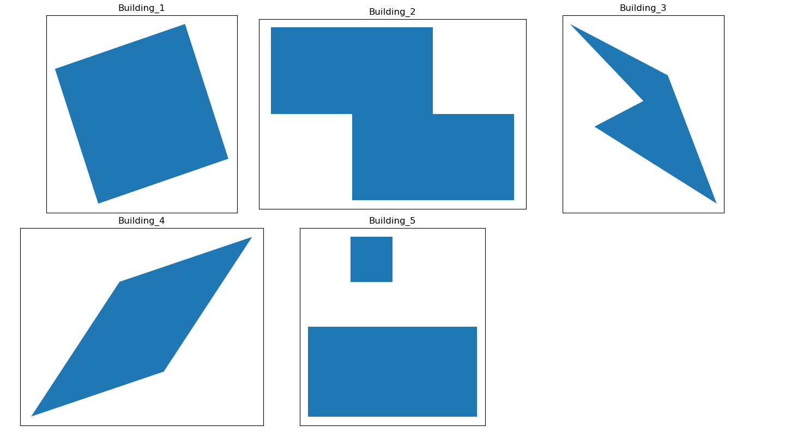
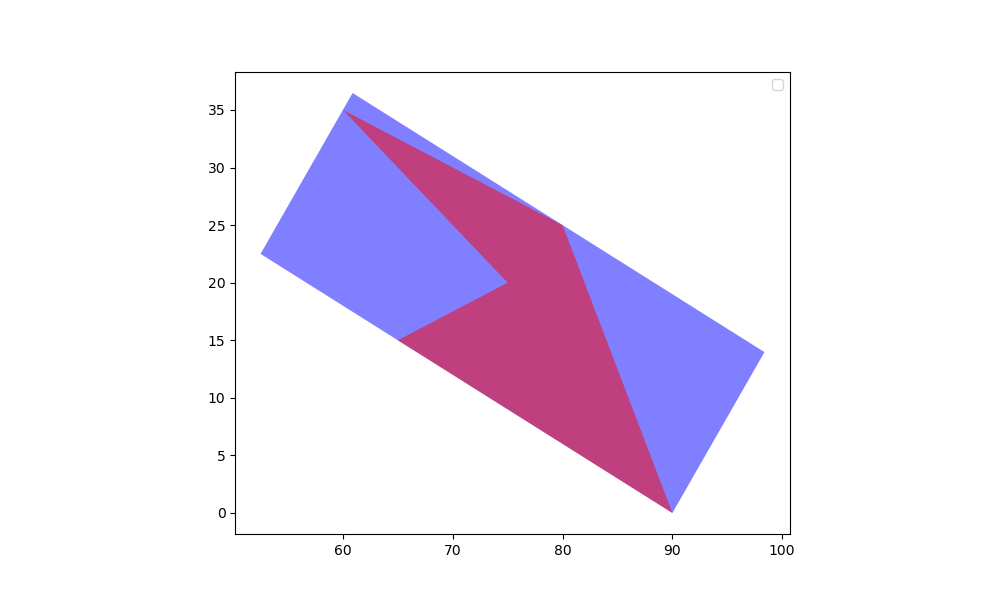
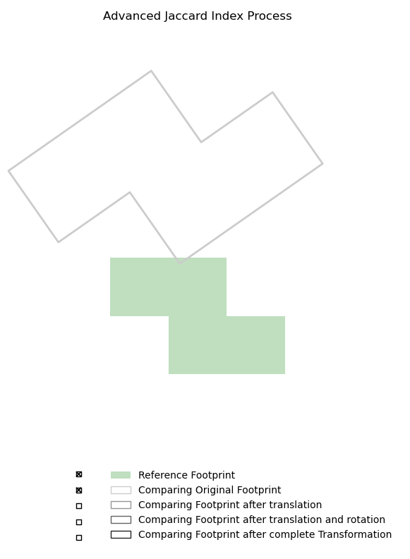
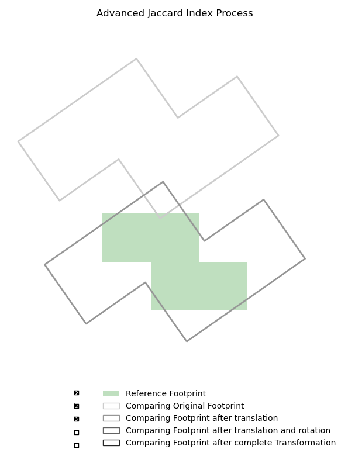
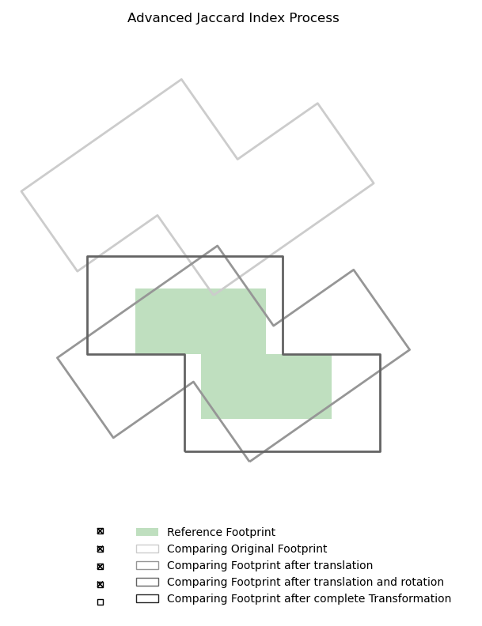
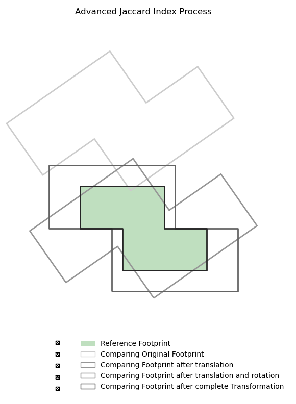

# Shape-Comparison

This repository is the code for a Geodata shape comparison tool. 

## Example Data Generation

The data_generation.py file generates basic geodata to represent example building footprints. The first version generates five different buildings: a basic rectangle that is rotated (Building_1), an L-shaped building (Building_2), an irregularly shaped footprint (Building_3), a trapezoidal shaped footprint (Building_4), and a footprint with a separated building, such as a garden building (Building_5).

### data_generation.py
The file includes the create_gpkg_file function, which takes a List of Lists filled with Point Coordinates and the file name as input parameters. Each List in the List of List represents one polygon of the footprint. Therefore, it can be used to create Multipolgons, for example, for Building_5. The Point coordinates represent the corner points of the footprint. The result is a Multipolygon, which is then placed into a GeoDataFrame. Next, the function creates various versions of this GeoDataFrame. All versions are saved separately as .gpkg files in the example_data folder.
To create various versions of each footprint, the function uses the functions from manipulate.py. Each footprint is scaled in six different sizes, shifted with four different values, and rotated with five angles, as well as a combination of all in four different levels. In a second step, each version is randomized by four different levels. In the end, each footprint has 100 different versions, including the original version. 
Each version is saved in the example_data folder with a unique filename containing the manipulations done to the footprint. 

### manipulate.py

The manipulate.py file contains a few functions to manipulate GeoDataFrames to create different versions of the same building. 
The code makes use of GeoPandas, a Python library designed for geospatial data manipulation, and Shapely, a package utilized for geometric object manipulation.

The scale functions is capable of scaling the GeoDataFrame in X and Y direction seperatly. The shift function shifts the GeoDataFrame in X and Y direction. There are two different rotating function, rotating_centroid rotates the GeoDataFrame around the centroid of the GeoDataFrame while rotate_point rotates the GeoDataFrame around a given Point. 
The randomize function tries to give the coordinate a realistic however simulated Measurement uncertainty. Each coordinate gets randomized seperatly which is done in the manipulate_coordinates function which is called by the randomized function automatically. The randomisation works within a given range in x and y direction. However the randomisation is evenly distributed by getting a random number within the range. Normally a measurement inaccuracy would be normally distributed. 

### build_db.py

This file creates a sqlite Databank from all files in example_data folder created above. The Databank then can be used to select example data as input for the comparison. The file name from the example data is used to set attributes in the Databank, such as manipulation_type, manipulation_intensity, subversion and randomized_level. 

## Comparison

### comparison.py

This file contains the actual comparison technique. 

#### compare_geopackages 

Note the advanced_Jaccard_index() function is a enhanced version of this function

The compare_geopackages function is getting called for a comparison between footprints. E.g. comparison_process.py calls this function every time it is doing a comparison.   
First it is using geopandas read_file function, to open the GeoPackage Files which are to be compared. Then it calculates the Jaccard Index for the first time. The JAccard Index is calculated by the jaccard_index function. 

The Second step is the translation step, here the offset between the two Footprints is calculated by comparing the centroid coordinates. Then it is chekced wether this offset is within Limit 1 or 2. Based on the result either the full translation is done, the maximum translation of Limit 2 ist done or no translation will be applied. This is done seperatly in X and Y direction. Therefore it can happen that in X direction a translation will be applied while in Y direction the translation falls out of the limits or vice versa. The translation itself is done in the shift_gdf(). Only the second Footprint is gonna be changed in this process. 
After the translation the Jaccard Index is calculated once again with the jaccard_index function.

Third step is the Rotation. The difficulty here is the definition of the rotation angle. To determine this first the minimum bounding rectanle of both Footprints is defined. For this the find_rotated_mbr function is used (see below). Then the longest side of the minimum bounding rectangle is definded. This is done by the longest_side_coordinates function (see below). Next the angle of this longest side is defined by the angle_of_line_segment() function (see below). THen the two angles of the longest side of the minimum biunding rectangles are compared to each other, the differences between these two angles is considered as the best angle to rotate the Footprint to align bith Footprints best. Next again it is checked wether the defined angle exceedes Limit 1 or 2 to check wether this angle can be applied to the comparing Footprint or not. Then the rotating angle is applied to the Footprint B. After the rotation again the Jaccard Index is calculated. 

Forth Step is the scaling. The scaling factor is determined by the root of the ratio of the two footprint surface areas. 
$$ SF = \sqrt{\frac{S(A)}{S(B)}} $$

- $SF $: Scaling Factor,
- $\ S(A) \$: Surface area of object $\ A \$,
- $\ S(B) \$: Surface area of object $\ B \$.

This scaling factor then gets compared to the Limits to choose the right scaling factor which gets applied to the Footprint B. 

Finally the final Jaccard Index can be calculated. The Results are concluded in a dictionary which gets returned from the compare_geopackages() function.
The Dictionary contains the original GeoDataFrames as well as all interim results of the second Footprints GeoDataFrame. The Dictionary also Contains all calculated Jaccard Indices as well as all transformation factors, the calculated as well as the factors actually applied to the Footprint. 

#### jaccard_index()
The Jaccard Index funtion first does an overlap Analysis by defining the intersecting area of both Footprints. Then the surfave Area of Footprint A and B is calculated as well as the surface area of the Intersetion of A and B. By these Values the Jaccard Index \( J(A, B) \) can be calculated as follows:

$$ \ J(A, B) = \frac{S(A \cap B)}{S(A) + S(B) - S(A \cap B)} \ $$

while

- $\ J(A, B) \$: Jaccard index between objects $\ A \$ and \ B \$,
- $\ S(A) \$: Surface area of object $\ A \$,
- $\ S(B) \$: Surface area of object $\ B \$,
- $\ S(A \cap B) \$: Surface area of the intersection of objects $\ A \$ and $\ B \$.

#### shift_gdf()

This function takes a GeoDataFrame as well as two translation parameters in X and in Y direction as input. The output is the shifted GeoDataFrame

#### rotate_gdf()

This function takes GeoDataFrame, and a rotating angle as input. Additionally a pivot point can be given as input. If no pivot point is given the centroid of the GeoDataFrame is used as pivot point. Output is the rotated GeoDataFrame

#### scale_gdf()

This function takes GeoDataFrame, and two scaling factors in X and Y direction. Output is the scaled GeoDataFrame

#### find_rotated_mbr()

This function takes a GeoDataFrame as input and returns the minimum bounding rectangle of this GeoDataFrame as a GeoDataFrame. The minimum boundign rectange is not restricted to the axis. Following figure can be used for better understanding.

#### find_longest_side_coordinates()

This function takes a minimum bounding rectangle as a GeoDataFrame as input. It returns the coordinates of the longest side of the minimum bounding rectangle. 

#### angle_of_line_segment()
This function takes a list of two coordinates to return the angle of the line between these two coordinates. The angle is returned in degrees the result can contain negativ results. 

### comparison_process.py

THis code first it uses fetch_building_data_by_base_name to select all Building_1 Datasets. Afterwards it compares the reference Building_1 with one manipulated version. This is done with all manipulated versions. A plot is created to make the result better understanble. The comparison itself uses the compare_geopackages function from comparison.py. The Limits are defined and passed to the comparison as well. 

#### fetch_building_data_by_base_name function

selects all example datasets by the basename (e.g. Building_1). Function returns the reference Building and all manipulated versions sepertly. 

#### plot() function

creates plots

## How does the advanced Jaccard indoex work?

The first figure shows the original data passed to the comparison. As we see the Comparing Footprint and reference footprint have not the same location nor the same alignment and scale. Note: In real life the diffeences between 2 footprints will not be as obvious as shown here. This example is only for demontrating the function of the Advanced Jaccard Index. For the basic demontration of the Advanced Jaccard Index the limits has been not taken into account. 

In the first step the shift_gdf() function is used to match the location with the reference using the centroid of both footprints.

As a second step the footprint is rotated. 

The third step scales the footprint. As a result the transformed footprint matches the reference completly, therefore the Jaccard Index is 1. Again this is a very theoretical case. With more practical data the two footprints will not be exactly equal and will not lead to a Jaccard Index of 1. 

## Limits

In the following the function of the limits is explained. 

THe limits use is to limit the maximum transformation which is done to footprint. This is done because footprints which are not the same should not come closer together. So the Jaccard Index between non matching footprints stays at original level. The aim of the advanced Jaccard Index is to determine footprint which represents the same building but not match completle due to different measurement techniques or other reasons. To conclude the transformation is to bring footprints closer together so they match better. The Limits should prevent the transformation if the transformation becomes to big. The goal is to create a bigger gap between matching and non matching footprints at the Jaccard Index. 
The limits are implemented for each transformation seperatly. Each transformation has 2 limtis. One limit describes the maximum transformation e.g. for the rotation 2 gon. The second limit describes until when the maximum transformation should be applied. This could be for example at 4 gon. In this case a rotation would be applied if the determined rotation is below 4 gon. If the determined rotation is above 4 gon the footprint is not rotated at all. If the detemrined rotation is between 2 and gon, lets say 3 gon, the maximum rotation of 2 gon is used. In case the determined roation is below 2 gon, e.g. 1 gon, the 1 gon is applied completly. T

# NRM_Building_Comparison.py

This file contains an interesting comparison of OSM Data with cadastre Data. 

